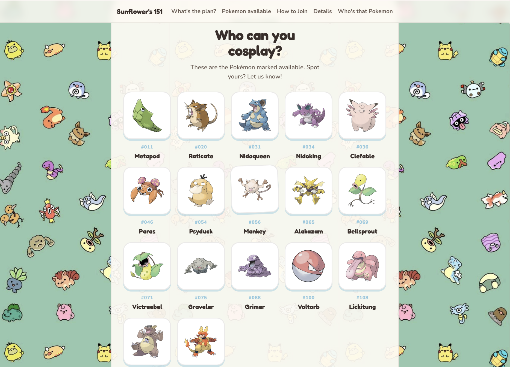
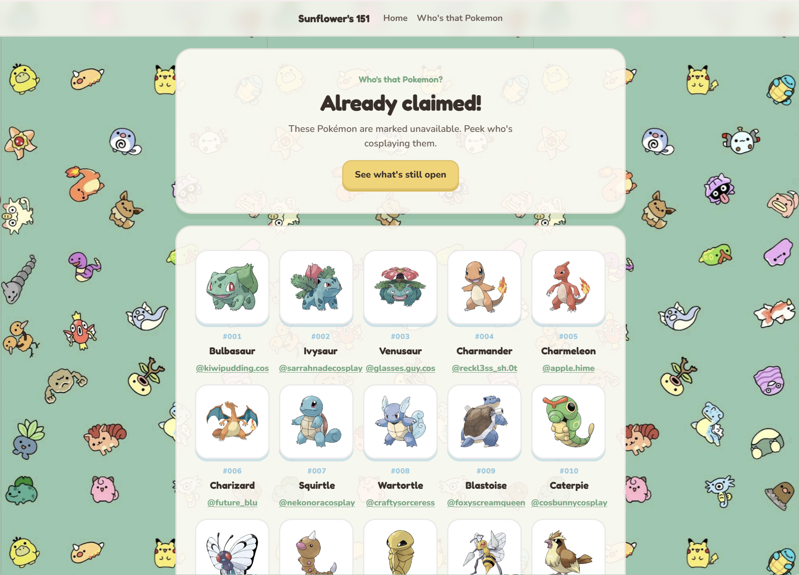

# Sunflower's 151

Website for **Sunflower's 151** — a fanmade Pokémon cosplay meetup in the SF Bay Area.

Unofficial. Not affiliated with Nintendo or The Pokémon Company.

## What the site looks like

### 1) First thing you see

The landing page — event name, the big “come join” message, and buttons to jump in.


### 2) Pokemon availability

The home page list of Pokémon still marked available (`TRUE` in the sheet).



### 3) Which can be cosplayed

The **Who's that Pokemon** page — Pokémon that are already taken (`FALSE`), with the cosplayer’s Instagram handle under each one.



## How the spreadsheet data works

Two Google Sheets power the whole site. The app pulls both, then combines them.

**Sheet 1 — availability**  
Dex #, Pokémon name, `available` (TRUE/FALSE), image URL.

**Sheet 2 — cosplayers**  
Pokémon name + Instagram handle (and other signup info).

How it gets used together:

1. Site fetches both sheets (through a proxy so the browser can read them).
2. `TRUE` rows from Sheet 1 → **Pokemon available** on the home page.
3. `FALSE` rows from Sheet 1 → **Who's that Pokemon** page.
4. For those `FALSE` ones, the site matches the Pokémon name to Sheet 2 and shows the IG handle.
5. Extra Sheet 2 rows that aren’t real Sheet 1 Pokémon (Nurse Joy, Rocket Grunt, etc.) get ignored.

Flip `TRUE`/`FALSE` in Sheet 1 and the lists update next time the page loads (or when someone comes back to the tab).

## Event basics

- **When:** September 13, 12pm–7pm (doors 11:30am)
- **Where:** South San Francisco (full address after signup)
- **Who:** 18+, ticket required
- **Host:** [Sunflowercos](https://www.instagram.com/sunflowercos) + Mimi, Sonic, Dame & Poppy

## Run it locally

```bash
npm install
npm run dev
```

## Deploy (Netlify)

- Build: `npm run build`
- Publish: `dist`

`netlify.toml` proxies the sheets and handles routes like `/whos-that-pokemon`.
